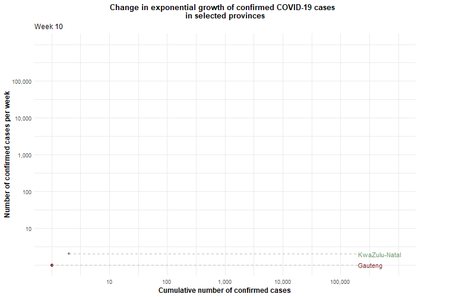

 

```{r message = FALSE, warning = FALSE, results = FALSE, eval=FALSE, echo=FALSE}

library(tidyverse)
library(dplyr)
library(ggplot2)
library(gganimate)
library(scales)

#create line graph
# for selection data
line <- provinces_selection_v2 %>% ggplot(aes(x= Cumulative, y= Count, group=Province, color=Province)) +
  geom_line(size = 0.5) +
  #set colours
  scale_color_manual(values=c("#7ABEBF", "#832A2F", "#6E9C73", "#3E5D92"))+
  geom_point(size = 1.5) +
  #Gauteng line and point
  geom_line(data = gp, aes(x= Cumulative, y= Count), size = 1 )+
  geom_point(data = gp,aes(x= Cumulative, y= Count),  size = 2)+
  #labels for Gauteng
  geom_segment(data = gp, aes(xend = 200000, yend = Count), linetype = 2, colour = 'grey')+
  geom_text(data = gp, aes(x = 200000.1, label = Province), hjust = 0)+
  #labels for other provinces
  geom_segment(aes(xend = 200000, yend = Count), linetype = 2, colour = 'grey')+
  geom_text(aes(x = 200000.1, label = Province), hjust = 0)+
  theme_minimal() +
  theme(plot.margin = margin(5.5, 100, 5.5, 5.5))  +
  theme(legend.position = "none") +
  coord_cartesian(clip = "off")+
  #scales and axes
  scale_x_continuous(name="Cumulative number of confirmed cases",
                     trans = log10_trans(),
                     limits=c(NA,1000000), 
                     labels = comma_format(big.mark = ",", decimal.mark = " "),
                     breaks=c(0,10, 100, 1000, 10000, 100000))+
  scale_y_continuous(name="Number of confirmed cases per week",
                     trans = log10_trans(),
                     limits=c(NA,1000000), 
                     labels = comma_format(big.mark = ",", decimal.mark = " "),
                     breaks=c(0,10, 100, 1000, 10000, 100000))+
  #moving chart
  transition_reveal(Week)+
  #labels for title and subtitle
  labs(title = "Change in exponential growth of confirmed COVID-19 cases  \n  in selected provinces",
       subtitle = 'Week {round(frame_along)}')+
  #cosmetics for text
  theme(plot.title = element_text(size= 13, face = "bold",hjust = 0.5),
        plot.subtitle = element_text(size = 12),
        axis.title = element_text(size = 12, face = "bold"),
        legend.title = element_text(size = 12, face = "bold"),
        legend.text = element_text(size = 11))


# Save at gif:
anim_save(filename = "test.gif", save_animation = "gif")

```

